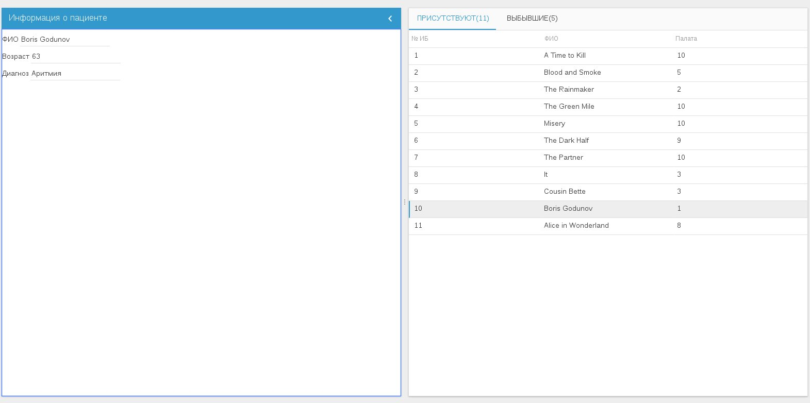
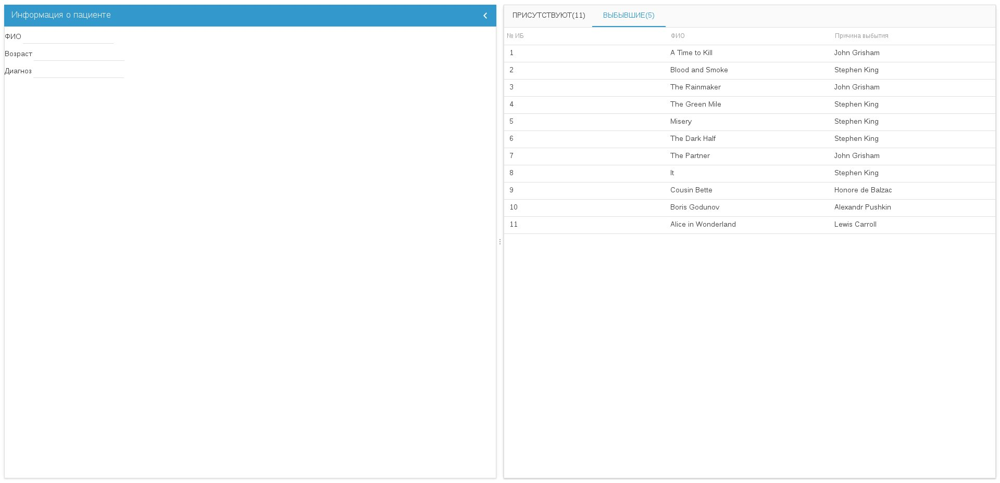

# Тестовое задание для компании ООО «Виста» на должность Javascript разработчика
 
Задание:

1. Необходимо реализовать интерфейс как на скриншотах.
2. Списки пациентов должны загружаться сразу для 2-х вкладок(Присутствует и Выбывшие) асинхронно.
3. Загрузка данных должна осуществляться с помощью ajax запросов к приложенным в письме json-файлам. Способ размещения json файлов на свое усмотрение (vps,использование ajax на jsfiddle и т.д)
4. После завершения загрузки данных в заголовке вкладок нужно выводить число загруженных пациентов для соответствующей вкладки(например Присутствует(15))
5. При клике на пациенте в таблице в левую панель должна подгружаться дополнительная информация о выбранном пациенте(см.скриншот)
 
Для выполнения тестового задания можно использовать открытые(open source) библиотеки и фреймворки. Само выполненное задание должно быть доступно либо через vps(+ исходники на github), либо на каком-нибудь сервисе типа jsfiddle.

 

## Скриншоты

 

## Ссылки для просмотра задания на CodeSandbox:
[В отдельном окне без кода](https://ivg1w.csb.app/)

[Вместе с кодом](https://codesandbox.io/s/github/mihalichpalich/vista_task)

 

Скачать на локальный компьютер:

### `git clone https://github.com/mihalichpalich/vista_task.git`

Установка и запуск:
### `cd vista_task && npm i && npm start`

 

## Стек технологий
* React 16
* Material-UI
* axios
